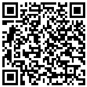
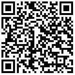
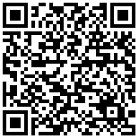
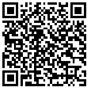
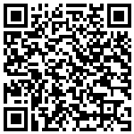
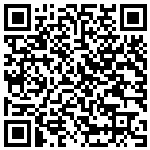
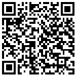
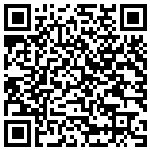

# Nbjump - Vue 驱动的多端开发框架

`Nbjump` 是由 Vue 驱动的多端开发框架，其语法规范完全遵循 Vue，支持一套代码同时运行到百度小程序、微信小程序以及 H5 Web 端。 

## 快速开始

```bash
# 安装 nbjump-cli
npm install -g @nbjump/cli

# 创建项目
nbjump create [projectName]

# 可选项：
# 是否支持 H5，如需支持 H5 请选择：小程序和 H5
? 选择创建项目类型： (Use arrow keys)
❯ 小程序和 H5
  仅小程序

# 开发模式
# 如果 target 是小程序，需要用小程序开发工具打开对应的 dist 目录
nbjump serve [--target, -t swan (default) | wx | h5]

# 构建模式
# 如果 target 是小程序，需要用小程序开发工具打开对应的 dist 目录
nbjump build [--target, -t swan (default) | wx | h5]

```

## 文档教程
[https://max-team.github.io/Nbjump/](https://max-team.github.io/Nbjump/)

## 案例

### 多端案例

| | 百度智能小程序 | H5 |
|-|-|-|
| 装馨家 |  | [](https://jia.baidu.com/m#/pages/home/index) |
| 健康养生说 |  | [](https://sp0.baidu.com/5LMDcjW6BwF3otqbppnN2DJv/health.pae.baidu.com/medauth/healthpage/#/pages/list/index) |
| 百股精 |  | [](http://finance.pae.baidu.com/selfselect/#/pages/index/index) |


### 小程序案例

| 百度百聘 | 百拍智能构图 | 百看君 | 百度作业模式 | 爱眼日 |
|-|-|-|-|-|
|  |  |  |  |  |

## Packages & CHANGELOGs

| package | version | CHANGELOG |
|-|-|-|
| @nbjump/core | [](https://www.npmjs.com/package/@nbjump/core) | [CHANGELOG](https://max-team.github.io/Nbjump/CHANGELOGS-0.3/core.html) |
| @nbjump/build | [](https://www.npmjs.com/package/@nbjump/build) | [CHANGELOG](https://max-team.github.io/Nbjump/CHANGELOGS-0.3/build.html) |
| @nbjump/cli | [](https://www.npmjs.com/package/@nbjump/cli) | [CHANGELOG](https://max-team.github.io/Nbjump/CHANGELOGS-0.3/cli.html) |
| @nbjump/cli-template | [](https://www.npmjs.com/package/@nbjump/cli-template) | [CHANGELOG](https://max-team.github.io/Nbjump/CHANGELOGS-0.3/cli-template.html) |
| @nbjump/api | [](https://www.npmjs.com/package/@nbjump/api) | [CHANGELOG](https://max-team.github.io/Nbjump/CHANGELOGS/api.html) |
| @nbjump/components | [](https://www.npmjs.com/package/@nbjump/components) | |

## Contributing & Discussion

请参考 [如何贡献](./CONTRIBUTING.md)

欢迎提 Issue 和 PR。

百度员工可以加 Hi 群：1659354
